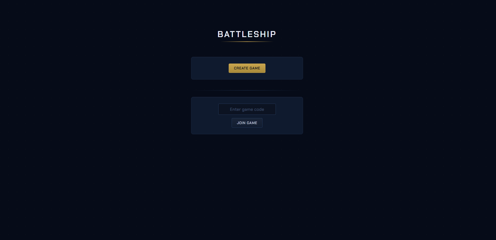
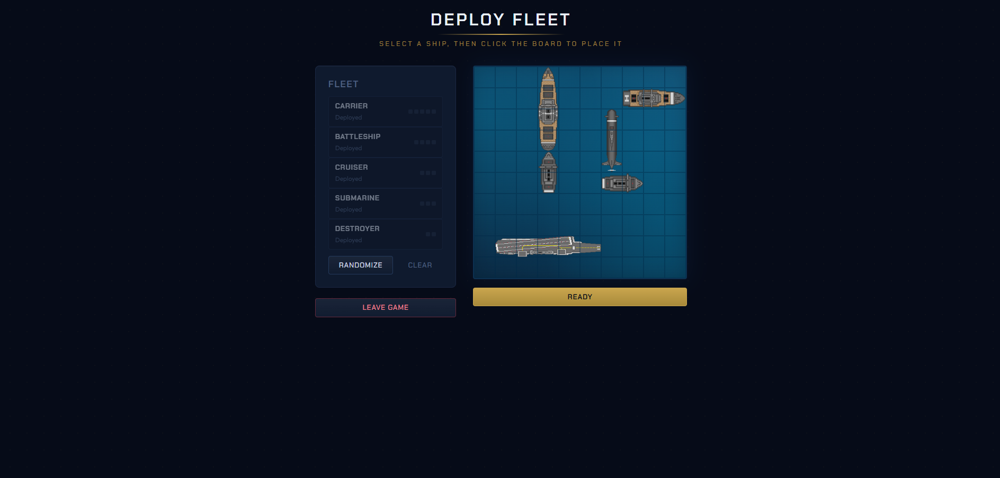
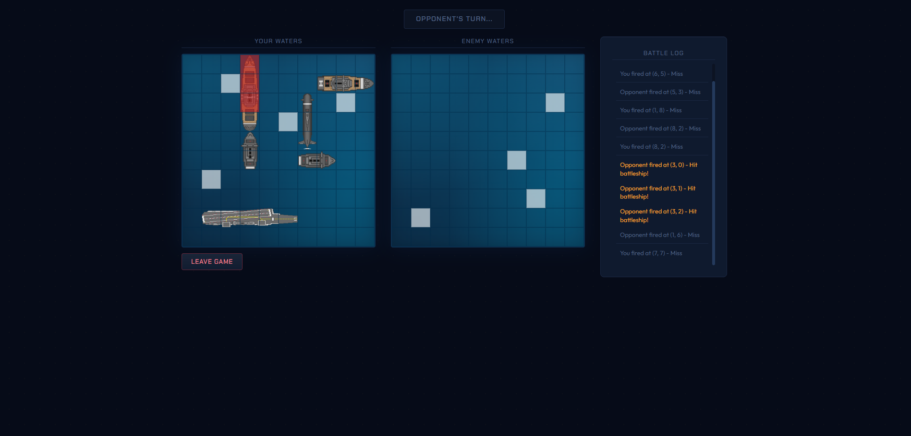
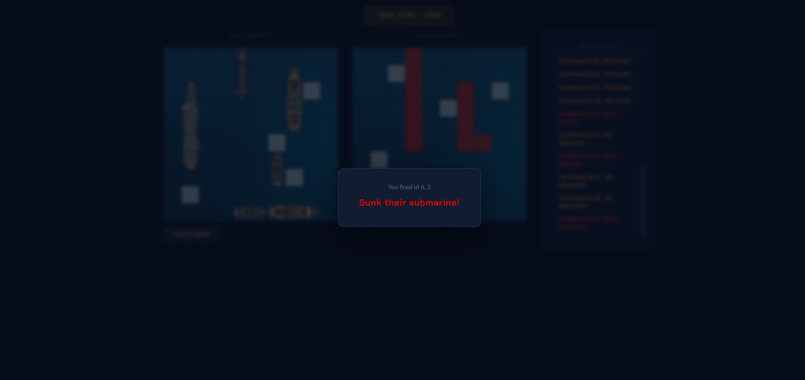
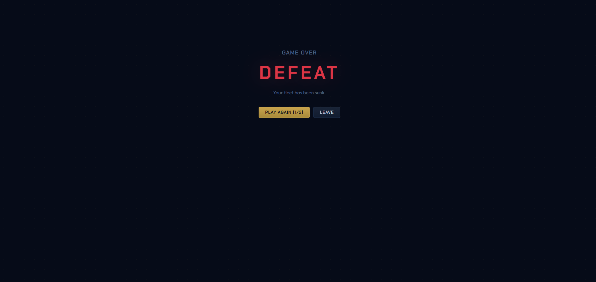

# Battleship

[Play it here](https://battleship.13bridgeman-b.workers.dev/)
> [!NOTE]
> The server is hosted on Render's free tier and may take up to 60 seconds to wake up on first connection.

A real-time multiplayer Battleship game. Players create or join games using a 6-character game code, place ships on their board, and take turns firing at their opponent. Built with a React frontend and an ASP.NET Core backend, communicating over SignalR WebSockets.

## Tech Stack

### Client

- React 19 with TypeScript
- Vite
- Microsoft SignalR client

### Server

- ASP.NET Core (.NET 8)
- SignalR
- xUnit (testing)

## Hosting

- **Client** - Cloudflare Pages (deployed via Wrangler)
- **Server** - Render

## Screenshots

### Main Lobby

### Setup Screen

### During Game

### Ship Sunk

### Game Over

